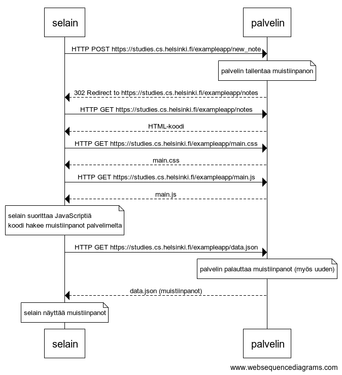

# Luku 0, tehtävät 4-6

## Tehtävä 0.4


```
selain->palvelin: HTTP POST https://studies.cs.helsinki.fi/exampleapp/new_note

note over palvelin
palvelin tallentaa muistiinpanon
end note

palvelin-->selain: 302 Redirect to https://studies.cs.helsinki.fi/exampleapp/notes
selain->palvelin: HTTP GET https://studies.cs.helsinki.fi/exampleapp/notes
palvelin-->selain: HTML-koodi
selain->palvelin: HTTP GET https://studies.cs.helsinki.fi/exampleapp/main.css
palvelin-->selain: main.css
selain->palvelin: HTTP GET https://studies.cs.helsinki.fi/exampleapp/main.js
palvelin-->selain: main.js

note over selain:
selain suorittaa JavaScriptiä
koodi hakee muistiinpanot palvelimelta
end note

selain->palvelin: HTTP GET https://studies.cs.helsinki.fi/exampleapp/data.json

note over palvelin
palvelin palauttaa muistiinpanot (myös uuden)
end note

palvelin-->selain: data.json (muistiinpanot)

note over selain:
selain näyttää muistiinpanot
end note
```

## Tehtävä 0.5


```
selain->palvelin: HTTP GET https://studies.cs.helsinki.fi/exampleapp/spa
palvelin-->selain: HTML-koodi
selain->palvelin: HTTP GET https://studies.cs.helsinki.fi/exampleapp/main.css
palvelin-->selain: main.css
selain->palvelin: HTTP GET https://studies.cs.helsinki.fi/exampleapp/spa.js
palvelin-->selain: spa.js

note over selain:
selain suorittaa JavaScriptiä
koodi hakee muistiinpanot palvelimelta
end note

selain->palvelin: HTTP GET https://studies.cs.helsinki.fi/exampleapp/data.json
palvelin-->selain: [{ content: "HTML on helppoa", date: "2019-01-01" }, ...]

note over selain:
selain näyttää muistiinpanot
end note
```

## Tehtävä 0.6


```
note over selain
selain lisää muistiinpanon listaan
end note

selain->palvelin: HTTP POST https://studies.cs.helsinki.fi/exampleapp/new_note_spa

note over palvelin
palvelin tallentaa muistiinpanon
end note

palvelin-->selain: 201 Created
```