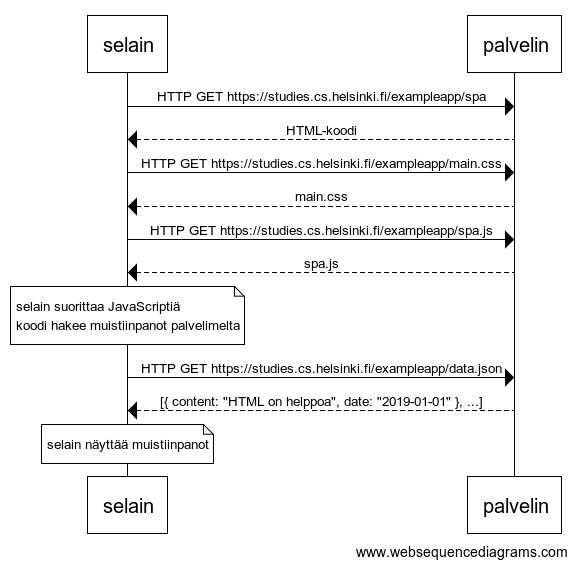

# Tehtävä 0.5


```
selain->palvelin: HTTP GET https://studies.cs.helsinki.fi/exampleapp/spa
palvelin-->selain: HTML-koodi
selain->palvelin: HTTP GET https://studies.cs.helsinki.fi/exampleapp/main.css
palvelin-->selain: main.css
selain->palvelin: HTTP GET https://studies.cs.helsinki.fi/exampleapp/spa.js
palvelin-->selain: spa.js

note over selain:
selain suorittaa JavaScriptiä
koodi hakee muistiinpanot palvelimelta
end note

selain->palvelin: HTTP GET https://studies.cs.helsinki.fi/exampleapp/data.json
palvelin-->selain: [{ content: "HTML on helppoa", date: "2019-01-01" }, ...]

note over selain:
selain näyttää muistiinpanot
end note
```